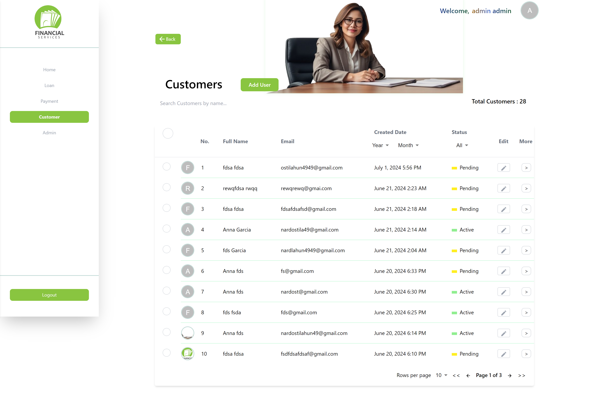
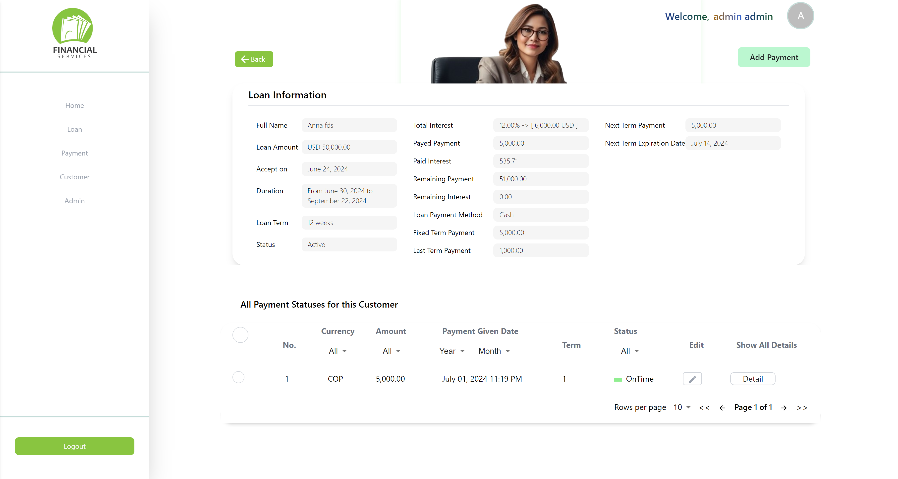

# Personal Financial Loan Website

## Introduction

Welcome to the Personal Financial Loan Website. This platform allows users to easily manage personal loans online. Our website is designed to provide a user-friendly experience for managing loan applications and tracking loan statuses.

## Table of Contents

- [Personal Financial Loan Website](#personal-financial-loan-website)
  - [Introduction](#introduction)
  - [Table of Contents](#table-of-contents)
  - [Installation](#installation)
    - [Frontend Installation](#frontend-installation)
    - [Backend Installation](#backend-installation)
  - [Configuration](#configuration)
  - [Running the Application](#running-the-application)
  - [Features](#features)
    - [General Features](#general-features)
      - [Pages (Detailed Features)](#pages-detailed-features)
    - [Admin Features](#admin-features)
    - [Customer Features](#customer-features)
  - [Detailed Feature Descriptions](#detailed-feature-descriptions)
  - [Pages Explanation](#pages-explanation)
    - [Admin Role Pages](#admin-role-pages)
      - [Dashboard Page](#dashboard-page)
      - [Add User Page](#add-user-page)
      - [Edit User Page](#edit-user-page)
      - [Add Loan Page](#add-loan-page)
      - [Edit Loan Page](#edit-loan-page)
      - [Add Payment Page](#add-payment-page)
      - [Edit Payment Page](#edit-payment-page)
      - [Customers Page](#customers-page)
      - [Admins Page](#admins-page)
      - [Loans Page](#loans-page)
      - [Payments Page](#payments-page)
      - [Customer Page](#customer-page)
      - [Loan Page](#loan-page)
      - [Payment Page](#payment-page)
    - [Customer Role Pages](#customer-role-pages)
      - [Customer Page](#customer-page-1)
      - [Loan Page](#loan-page-1)
  - [Contact](#contact)

## Installation
  [Back to Table of Contents](#table-of-contents)

To install the Personal Financial Loan Website locally, follow these steps:

1. Clone the repository:

   ```
   git clone https://github.com/Nardos-Tilahun/Lending_Project.git
   ```

2. Navigate into the project directory:

   ```
   cd Lending_Project
   ```

### Frontend Installation

To install the frontend of the Personal Financial Loan Website, follow these steps:

1. Make sure you are in Lending_Project directory:

2. Navigate to the frontend directory:

   ```
   cd Frontend
   ```

3. Install frontend dependencies:

   ```
   npm install
   ``` 
   
   In case of conflicts, use:

   ```
   npm install --force
   ```

### Backend Installation

To install the backend of the Personal Financial Loan Website, follow these steps:

1. Make sure you are in `Lending_Project` directory:

2. Navigate to the backend directory:

   ```
   cd Backend
   ```

3. Install backend dependencies:

   ```
   npm install
   ``` 
   
   In case of conflicts, use:

   ```
   npm install --force
   ```

## Configuration
[Back to Table of Contents](#table-of-contents)
- To obtain the necessary configuration details for the Personal Financial Loan Website, please contact our support team or project administrator.
- They will provide you with the required environment variables to set in your Backend/.env and Frontend/.env files, as well as the login credentials for the first time.

## Running the Application
[Back to Table of Contents](#table-of-contents)
After installing dependencies and setting the required environment variables for both frontend and backend, follow these steps to run the application:

1. Start the Backend server:

   ```
   nodemon app.js
   ```

   If you don't have nodemon installed globally, install it:

   ```
   npm install nodemon
   ```

2. Start the Frontend server:

   ```
   npm run dev
   ```

3. Open your web browser and navigate to `http://localhost:5173` to view the application.

4. To install the database and admin account, navigate to:

   ```
   http://localhost:5173/installmyappreset
   ```

5. Login credentials will be provided by our support team.

## Features
### General Features
[Back to Table of Contents](#table-of-contents)
- **Login Feature (Authentication and Authorization)**
- **Password Reset Features (Confirmation for Valid Email)**

#### Pages (Detailed Features)
[Back to Table of Contents](#table-of-contents)
- **Login Page**
  - Open for all users and navigates to "login," sometimes serves as a landing page for logged-out users
  - Includes email and password fields
  - Email should be valid to receive notifications
  - Password visibility toggle
  - Error messages displayed above the email field:
    - "Please enter a valid email or Password" if the email or password is invalid
    - "Something went wrong. Please try again later." for internal errors

- **Password Reset Page**
  - Open when the user clicks the reset confirmation button from their email
  - Includes email, new password, and confirmation password fields
  - Password visibility toggle

- **Page Not Found Page**
  - Displays a centered image indicating page not found
  - Label: "Oops! Page Not Found" and "It seems like you've taken a wrong turn"
  - Button to navigate to the home page

- **Server Error Page**
  - Displays a centered image indicating server error
  - Label: "500 - Server Error" and "Oops! Something went wrong on our end. Please try again later."
  - Button to navigate to the home page

### Admin Features
[Back to Table of Contents](#table-of-contents)
- **User Management**
  - Register new users
  - Edit user information
  - Delete users

- **Loan Management**
  - Register new loans
  - Edit and delete loans (only if the loan is pending and doesn't have any payments)
  - Delete loans on other statuses after deleting all payments under them

- **Payment Management**
  - Add new payments
  - Edit and delete payments (only recent payments under the loan can be edited or deleted)
  - Delete non-recent payments by first deleting the recent payment, making the succeeding payment the new recent payment

- **Overview Features**
  - Displays total and active customers (customers with at least one active loan that hasn't started or completed)
  - Graphs showing weekly, monthly, and yearly lending amounts with respective interest
  - Pie chart showing total interest paid and unpaid for weekly, monthly, and yearly periods
  - Transaction table listing loans and payments, arranged by fullname, issue date, type (currency in USD and Colombian Peso), amount, and status, with edit and more (detail) options and search functionality

- **Tabular Representation with Sorting and Filtering**
  - Shows registered users (Admin and Customer)
  - Shows transactions (Loans and Payments)

- **Confirmation Sent Message**
  - For admin to send notifications to customers, their registered email must be valid
  - Notifications for loan registration and payment creation are sent upon confirmation

### Customer Features
[Back to Table of Contents](#table-of-contents)
- **View Features**
  - Show customer personal information
  - Show payment and loan information

- **Tabular Representation with Sorting and Filtering**

## Detailed Feature Descriptions
[Back to Table of Contents](#table-of-contents)
- **User Authentication**: Secure registration and login functionality for both admin/borrowers and customers.
  
- **Loan Application Management**: Admins/borrowers can register new loans, manage loan details (edit/delete), and track the status of each loan.
  
- **Payment Management**: Admins/borrowers can manage payments associated with loans, including adding new payments, editing existing ones, and deleting payments if necessary.
  
- **Customer View**: Customers can securely log in to view the status of their loans, transaction history related to payments, and details about upcoming payments.

- **Responsive Design**: Ensures that the application provides a seamless user experience across different devices


## Pages Explanation
### Admin Role Pages
#### Dashboard Page
[Back to Table of Contents](#table-of-contents)

- **Header**
  - Two buttons on the right:
    - 'Add Loan': Navigates to Add Loan Page.
    - 'Add Payment': Navigates to Add Payment Page.

- **Dashboard Sections**
  1. **Circular View**
     - **Total Customers**:
       - Default: Shows total registered customers.
       - On Hover: Displays active customers (those with active loans).
     - **Total Lending**:
       - Default: Shows total amount lent in USD.
       - On Hover: Displays outstanding loan amount in USD.

  2. **Vertical Graph and Pie Chart**
     - **Vertical Bar Graph**:
       - Displays total lending (blue) and interest amount (orange) over time.
       - Dropdown for duration:
         - Weekly Period: Last 10 weeks (starting on Monday).
         - Monthly Period (Default): Last 10 months (starting on 1st day).
         - Yearly Period: Last 5 years (starting on January 1st).
       - Hover over bars to view total lending and interest values.

     - **Pie Chart**:
       - Shows total interest divided into paid (blue) and unpaid (orange).
       - Navigation options for total, yearly, monthly, and weekly periods.
       - Breakdown of paid, unpaid, and total interest displayed below.

  3. **Transaction Table**
     - **Header**
       - Search: Filter transactions by customer name.
       - Recent Button:
         - Appears when table is filtered.
         - Resets table to default view on click.

     - **Columns**
       - **Selection**: Allows batch deletion of transactions.
         - Confirmation page appears for recent payments or pending loans.
       - **Number**: Transaction order number.
       - **Full Name**: Customer name, sortable.
       - **Issued Date**: Transaction date, sortable and filterable.
       - **Type**: Loan or payment indicator, filterable.
       - **Currency**: USD or COP, filterable.
       - **Amount**: Transaction amount, sortable and filterable.
       - **Status**: Transaction status, filterable.
       - **Edit**:
         - Allows editing based on transaction type and status.
         - Navigates to customer page for detailed editing.
       - **More**: Provides detailed transaction information.

     - **Pagination**
       - Navigation through transaction pages.
       - Options for transactions per page (5, 10 default, 20, 50, 100, All).
       - First, last, previous, and next page navigation buttons.
       - Current page number and total pages displayed.
[Back to Table of Contents](#table-of-contents)
#### Add User Page
[Back to Table of Contents](#table-of-contents)

- Dialog window in the center of the screen, titled "Add User".
- Accessed via:
  - Customer Page header ("Customer" sidebar option).
  - Admin Page header ("Admin" sidebar option).
  - Add Loan Page header ("Add Loan" button).
- Form to register a new user:
  - **First Name**: Mandatory, accepts only alphabet letters.
  - **Last Name**: Mandatory.
  - **Email**: Mandatory and unique.
    - Format: example@email.com.
  - **Role Category**: Mandatory, defaults to Customer if accessed from Customer Page.
  - **Password**: Mandatory, minimum 8 characters, with visibility toggle.
  - **Confirm Password**: Mandatory, must match password.
  - **Country Category**: Optional, all countries available.
  - **State Category**: Optional, based on selected Country.
  - **City Category**: Optional, based on selected State.
  - **Street Address**: Optional.
  - **Phone Number**: Mandatory, automatically includes country code.
  - **Secondary Phone Number**: Optional.
  - **Zip Code**: Optional.
  - **Profile Picture**: Optional, JPEG/PNG format, max 500KB.
  - **Create User** button at bottom right.

- **Validation and Error Handling**:
  - Error messages displayed for each field that doesn't meet criteria.
  - Reset button to clear errors and reset fields.
  - Confirmation for Admin role:
    - Lists admin access details.
    - Confirm or cancel option.
  - Confirmation for Customer role:
    - Sends confirmation email for verification.
    - Confirmation link expires in 24 hours.

- **Close Button**: Top right corner to close Add User page at any time.
[Back to Table of Contents](#table-of-contents)
#### Edit User Page
[Back to Table of Contents](#table-of-contents)

- Dialog window in the center of the screen, titled "Edit User".
- Accessed via:
  - Customers Page: "Edit" icon under customer information in the table.
  - Admins Page: "Edit" icon under admin information in the table.
- Form to edit user information:
  - Includes all fields from Add User form with default values pre-filled.
  - Email and role cannot be edited.
  - Displays previous values for comparison when changed.
  - **No Change User** button initially disabled, changes to **Save Changes** when fields are edited.
  - Validation and error handling similar to Add User page.
  - Confirmation and error messages upon Save Changes attempt.
  - **Close Button**: Top right corner to close Edit User page at any time.
[Back to Table of Contents](#table-of-contents)
#### Add Loan Page
[Back to Table of Contents](#table-of-contents)

- Dialog window in the center of the screen, titled "Add Loan".
- Accessed via:
  - Home/Dashboard Page header by clicking Home or logo button on the sidebar.
  - Loans Page by clicking Loan button on the sidebar.
  - Add Payment Page header by clicking Add Payment button on the Home Page header.
  - Right header of Customer Page: "More" column/last column/detail icon button on customers or admin list table row.
- Form to create a new loan for a customer:
  - Initially shows search bar to find registered customer by name, email, or phone number.
  - Selecting a customer displays their details in the header.
  - Warning if customer has an active loan, with option to view previous active loans.
  - Reset button to clear values and errors, reverting to search bar.
  - **Close Button**: Top right corner to close Add Loan page at any time.

- **Loan Fields**:
  - **Loan Amount**: Mandatory, positive numbers only.
  - **Periods Category**: Mandatory, options: weekly, bi-weekly, monthly, semi-annually, annually.
    - Starting dates adjust accordingly based on selected period.
  - **Currency Category**: Mandatory, default: "USD".
    - Options: USD, COP (Colombian PESO).
  - **Payment Method Category**: Mandatory, default: "Cash".
    - Options: Cash, Debit-Card, Credit-Card, Bank, Others.
  - **Duration Category**: Mandatory, based on selected period:
    - **Insert Expire Date**: Calendar input for expiration date.
    - **Insert How Many Term**: Input for term length in positive integers (up to 1000).
  - **Calculated Expire Date**: Read-only label showing calculated expiration date.
  - **Insert Rate**: Mandatory, percentage format for interest rate.
  - **Total Interest**: Read-only label showing calculated total interest.
  - **Start Date Option**: Mandatory, adjusts based on selected period:
    - **Start Right Now**: Immediate start based on selected period.
    - **Pick Start Date**: Calendar input for specific start date.
  - **Calculated Starting Date**: Read-only label showing calculated start date.
  - **Purpose**: Optional, loan purpose if applicable.
  - **Collateral**: Optional, collateral details if applicable.
  - **Create Loan** button at bottom right.
  
- **Validation and Error Handling**:
  - Error messages displayed for fields with incorrect input.
  - Confirmation messages upon successful loan creation.
  - Error handling redirects to "/500" page for server issues.

- **Close Button**: Top right corner to close Add Loan page at any time.
[Back to Table of Contents](#table-of-contents)
#### Edit Loan Page
[Back to Table of Contents](#table-of-contents)


- It is a dialog window that appears in the middle of the screen on top of other pages with a title of "Edit Loan" at the top.
- To edit the loan, it must be in pending status with no registered payments. If there are payments, the edit button will be disabled with a label "you have payment under it".
- You can navigate to the Edit Loan page by clicking the edit icon button on a pending loan, located:
  - In the Loans Page under the table rows of a loan in the "Edit" column of the loans table.
  - In the Home Page under the table rows of a latest transaction in the "Edit" column of the transaction table.
- It is a form to edit loan information:
  - Includes all fields from the Add Loan Form with default values of the previous loan values.
  - Shows a reset button on the top right corner.
  - Displays previous values for comparison when changes are made.
  - Changes the button to "Save Changes" when any field is edited.
  - Validates mandatory fields before allowing "Save Changes".
  - Upon successful save, shows a success information page with "Loan data updated successfully".
- You can close the Edit Loan page anytime by clicking the "X" button on the top right corner.
[Back to Table of Contents](#table-of-contents)
#### Add Payment Page
[Back to Table of Contents](#table-of-contents)


- It is a dialog window that appears in the middle of the screen on top of other pages with a title of "Add Payment" at the top.
- You can navigate to the Add Payment page by clicking the Add Payment button located:
  - In the Home / Dashboard / Page header by clicking Home or the logo button on the sidebar to add a new payment.
  - In Payments Page by clicking Payment button on the sidebar to add a new payment.
  - In the right header of Loan Page by clicking the more column / last column / detail icon button on the loans list or transaction list table row.
  - In the right header of Payment Page by clicking the more column / last column / detail icon button on the payment list or transaction list table row.
- It is a form to add or create a new payment for a specific loan of a customer:
  - Initially shows a search bar to find a registered loan by Name, Email, Loan Amount, and Given Date.
  - Displays selected or generated customer's Name, Email, Loan Amount, and Given Date in the header upon selection.
  - Opens fields to add payment information after customer selection.
  - Shows a reset button on the top right corner.
  - You can close the Add Payment page anytime by clicking the "X" button on the top right corner.
  - Validates mandatory fields before allowing "Create Payment".
  - Upon successful creation, shows a success information page with details of the payment received.
[Back to Table of Contents](#table-of-contents)
#### Edit Payment Page
[Back to Table of Contents](#table-of-contents)


- It is a dialog window that appears in the middle of the screen on top of other pages with a title of "Edit Payment" at the top.
- To edit the payment, it must be a recent payment with no subsequent payments under the same loan. If there are subsequent payments, the edit button will be disabled with a label "It's not a recent payment".
- You can navigate to the Edit Payment page by clicking the edit icon button of a recent payment located:
  - In the Payment Page under the table rows of payment information in the "Edit" column of the payments table.
  - In the Home Page under the table rows of a latest transaction in the "Edit" column of the transaction table.
- It is a form to edit payment information:
  - Includes all fields from the Add Payment Page Form with default values of the previous payment values.
  - Shows a reset button on the top right corner.
  - Displays previous values for comparison when changes are made.
  - Changes the button to "Save Changes" when any field is edited.
  - Validates mandatory fields before allowing "Save Changes".
  - Upon successful save, shows a success information page with "Payment data updated successfully".
- You can close the Edit Payment page anytime by clicking the "X" button on the top right corner.
[Back to Table of Contents](#table-of-contents)
#### Customers Page
[Back to Table of Contents](#table-of-contents)


- It is a component that appears as the body of the screen window below the header and beside the sidebar pages with a title of "Customers" at the top.
- You can navigate to the Customers Page by clicking the "Customer" navigation button from the sidebar.
- **Header:**
  - Includes a "<-back" button on the left side to navigate to the previous page.
  
- **Customers Table:**
  - **Header:**
    - Table name: "Customers".
    - Includes an "Add User" button next to the table name that navigates to the Add User Page.
    - Search field: Allows searching customers by customer name.
    - Displays the total number of registered customers.
    - Recent button: Appears when the table is not in its default state and resets the table view to default when clicked.
  - **Columns:**
    - Selection: Allows selecting customers for deletion.
    - Profile Picture: Displays the profile picture of the customer or uses the first letter of the first name if no picture is available.
    - Number: Order number of customers.
    - Full Name: Displays the customer's name, sortable.
    - Created Date: Date when the customer was created, sortable and filterable by year and month.
    - Type: Indicates if the customer is related to a loan or payment, filterable.
    - Status: Indicates the customer status (pending or active), filterable.
      - Pending indicates no loans or completed loans.
      - Active indicates an ongoing loan.
    - Edit: Allows editing customer details, navigating to the "Edit User" page.
    - More: Provides detailed information about each customer, navigating to a separate customer page.
  - **Pagination:**
    - Allows navigating through customer pages with options to select the number of customers per page.
    - Provides options to show 5, 10 (default), 20, 50, 100 customers per page or display all customers.
    - Includes navigation buttons "<<", ">>", "<-", "->", and page number indicators.
#### Admins Page
[Back to Table of Contents](#table-of-contents)


- It is a component that appears as the body of the screen window below the header and beside the sidebar pages, with a title of "Admins" at the top of its page.
  - Navigation:
    - Click the "Admin" navigation button in the sidebar to navigate to the Admins Page.
- Header:
  - `<- Back` button on the left side to navigate to the previous page.
- Admins Table:
  - **Header:**
    - Table name: "Admins"
    - "Add User" button next to the table name, linking to the Add User Page.
    - Search field: Allows searching admins by name.
    - Total Admins: Displays the total number of registered admins.
    - Recent button:
      - Appears when the table is not in its default state.
      - Resets the table to its default view when clicked and then disappears.
  - **Columns:**
    - Selection: Allows selecting admins for deletion.
      - Header selection selects all admins for deletion.
      - Confirmation page for deletion with Confirm and Cancel buttons.
        - On Confirm:
          - Success message pops up: "Selected admin has been successfully deleted."
          - Close button at the bottom of the information page to return to the remaining admins.
        - On Error:
          - Navigates to "/500" page indicating an internal server error.
          - Clicking "Admin" button in the sidebar can return to the Admins Page.
    - Profile Picture: Displays the admin's profile picture; if absent, uses the first letter of the first name.
    - Number: Order number of admins.
    - Full Name: Admin's name, sortable.
    - Created Date: Date the admin was created, sortable and filterable by year and month.
    - Edit:
      - Allows editing admins.
      - Navigates to separate "Edit User" page.
    - Detail:
      - Provides detailed information about each admin.
      - Expands the row to show details within the table without navigating to a separate page.
      - Detail header has a "Show All Detail" button to toggle hiding and showing details (e.g., phone number, second phone number, created by, address).
  - **Pagination:**
    - Allows navigation through admin pages with options to select the number of admins per page.
    - Options to show 5, 10 (default), 20, 50, 100, or All admins per page.
    - Navigation buttons:
      - "<<": First page of admins.
      - ">>": Last page of admins.
      - "<-": Previous page of the current page.
      - "->": Next page of the current page.
    - Middle section displays:
      - Current page number.
      - Total number of pages available.

#### Loans Page
[Back to Table of Contents](#table-of-contents)


- It is a component that appears as the body of the screen window below the header and beside the sidebar pages, with a title of "Loans" at the top of its page.
  - Navigation:
    - Click the "Loan" navigation button in the sidebar to navigate to the Loans Page.
- Header:
  - `<- Back` button on the left side to navigate to the previous page.
- Loans Table:
  - **Header:**
    - Search: Allows searching loans by customer name.
    - Recent button:
      - Appears when the table is not in its default state.
      - Resets the table to its default view when clicked and then disappears.
  - **Columns:**
    - Selection: Allows selecting loans for deletion.
      - Header selection selects all loans for deletion but only applies to pending status loans.
      - Confirmation page for deletion with Confirm and Cancel buttons.
        - On Confirm:
          - Success message pops up: "Loan has been successfully deleted."
          - Close button at the bottom of the information page to return to the remaining loans.
        - On Error:
          - Navigates to "/500" page indicating an internal server error.
          - Clicking "Loan" button in the sidebar can return to the Loans Page.
    - Number: Order number of loans.
    - Full Name: Customer's name, sortable.
    - Issued Date: Date the loan was issued, sortable and filterable by year and month.
    - Currency: Type (USD or COP), filterable.
    - Amount: Loan amount, sortable and filterable by range (e.g., below 1K, 1K - 5K, 5K - 10K, etc.).
    - Status:
      - Indicates the loan status (Pending, Active, Late, Completed, Late Completed, Terminated), filterable.
    - Edit:
      - Allows editing loans under certain conditions.
      - Navigates to separate "Edit Loan" page.
    - More:
      - Provides detailed information about each loan.
      - Navigates to separate "Loan" page.
  - **Pagination:**
    - Allows navigation through loan pages with options to select the number of loans per page.
    - Options to show 5, 10 (default), 20, 50, 100, or All loans per page.
    - Navigation buttons:
      - "<<": First page of loans.
      - ">>": Last page of loans.
      - "<-": Previous page of the current page.
      - "->": Next page of the current page.
    - Middle section displays:
      - Current page number.
      - Total number of pages available.

#### Payments Page
[Back to Table of Contents](#table-of-contents)


- It is a component that appears as the body of the screen window below the header and beside the sidebar pages, with a title of "Payments" at the top of its page.
  - Navigation:
    - Click the "Payment" navigation button in the sidebar to navigate to the Payments Page.
- Header:
  - `<- Back` button on the left side to navigate to the previous page.
- Payments Table:
  - **Header:**
    - Search: Allows searching payments by customer name.
    - Recent button:
      - Appears when the table is not in its default state.
      - Resets the table to its default view when clicked and then disappears.
  - **Columns:**
    - Selection: Allows selecting payments for deletion.
      - Header selection selects all payments for deletion but only applies to recent payments.
      - Confirmation page for deletion with Confirm and Cancel buttons.
        - On Confirm:
          - Success message pops up: "Payment has been successfully deleted."
          - Close button at the bottom of the information page to return to the remaining payments.
        - On Error:
          - Navigates to "/500" page indicating an internal server error.
          - Clicking "Payment" button in the sidebar can return to the Payments Page.
    - Number: Order number of payments.
    - Full Name: Customer's name, sortable.
    - Issued Date: Date the payment was issued, sortable and filterable by year and month.
    - Currency: Type (USD or COP), filterable.
    - Amount: Payment amount, sortable and filterable by range (e.g., below 1K, 1K - 5K, 5K - 10K, etc.).
    - Status:
      - Indicates the payment status (Late, onTime), filterable.
    - Edit:
      - Allows editing payments under certain conditions.
      - Navigates to separate "Edit payment" page.
    - More:
      - Provides detailed information about each payment.
      - Navigates to separate "payment" page.
  - **Pagination:**
    - Allows navigation through payment pages with options to select the number of payments per page.
    - Options to show 5, 10 (default), 20, 50, 100, or All payments per page.
    - Navigation buttons:
      - "<<": First page of payments.
      - ">>": Last page of payments.
      - "<-": Previous page of the current page.
      - "->": Next page of the current page.
    - Middle section displays:
      - Current page number.
      - Total number of pages available.

#### Customer Page
[Back to Table of Contents](#table-of-contents)


- It is a component that appears as the body of the screen window below the header and beside the sidebar component.
- Has the following sections:
  - **Customer Information**: Always appears when the customer is created.
  - **Payment Information**: Only appears if there is a loan under that customer.
  - **Loan Information**: Only appears if there is a loan under that customer.
- Navigation to "Customer" Page:
  - Clicking rows in the "More" column icon navigation button from a table of "Customers" by picking a specific customer row.
- **Header**:
  - Two buttons on the left and right of the header:
    - `<- Back` button navigates to the previous page.
    - `Add Loan` button navigates to "Add Loan" page using customer information.
- **Customer Information**:
  - Section labeled as "Information".
  - Contains:
    - Full Name of the customer.
    - Email of the customer:
      - Verified: Shows a checkmark and "Don't Notify" button.
      - Not verified: Shows a red X and "Notify User" button.
    - Phone number of the customer.
    - Address: Street Address, City, State, Zip Code, Country (if available).
- **Payment Information**:
  - **Next Payment Information**:
    - Customer's next term payment amount.
    - Due date of the next term payment.
  - **Total Remaining Payment**:
    - Total remaining payment including interest.
    - Due date of the last expired loan.
- **Loan Information under the Customer**:
  - Table listing all loans under the customer:
    - Columns include selection, number, currency, amount, loan given date, term, status, edit, detail.
    - Pagination options available.
    - Actions include deletion (pending status only) and editing (pending status only).

#### Loan Page
[Back to Table of Contents](#table-of-contents)


- It is a component that appears as the body of the screen window below the header and beside the sidebar component.
- Has the following sections:
  - **Loan Information**: Always appears when the loan is created.
  - **Payment Information**: Only appears if there is a payment under that loan.
- Navigation to "Loan" Page:
  - Clicking rows in the "More" column icon navigation button from a table of "Loans" to show more details about the loan.
  - Clicking rows in the "Detail" column icon navigation button from "Customer" Page of "Loans table" component.
- **Header**:
  - Two buttons on the left and right of the header:
    - `<- Back` button navigates to the previous page.
    - `Add Loan` button navigates to "Add Payment" page using loan information.
- **Loan Information**:
  - Section labeled as "Loan Information".
  - Contains:
    - Full Name of the customer.
    - Loan amount in currency.
    - Date loan was accepted.
    - Duration from start date to expiration date.
    - Loan term and status.
    - Total interest with calculated amount.
    - Paid and remaining payments.
    - Loan payment method and details.
- **Payment Information under this specific Loan**:
  - Table listing all payments under the loan:
    - Columns include selection, number, full name, currency, amount, payment given date, term, status, edit, details.
    - Pagination options available.
    - Actions include deletion (recent payments only) and editing (recent payments only).

#### Payment Page
[Back to Table of Contents](#table-of-contents)


- It is a component that appears as the body of the screen window below the header and beside the sidebar component.
- Has the following sections:
  - **Payment Information**: Always appears when the payment is created.
  - **Loan Information**: Always appears when the payment is created.
- Navigation to "Payment" Page:
  - Clicking rows in the "More" column icon navigation button from a table in the "Payments" page by picking a specific loan row.
- **Header**:
  - Two buttons on the left and right of the header:
    - `<- Back` button navigates to the previous page.
    - `Add Payment` button navigates to "Add Payment" page using the loan information.
- **Payment Information**:
  - Section labeled as "Term {payment term} - Payment Information".
  - Contains:
    - Payment term.
    - Payment amount in currency.
    - Payment date.
    - Payment status, interest, principal, method, next payment details, penalty rate, penalty payment, late reason.
- **Loan Information**:
  - Section labeled as "Loan Information Associated with This Payment".
  - Contains:
    - Full Name of the customer.
    - Loan amount in currency.
    - Date loan was accepted.
    - Duration from start date to expiration date.
    - Loan term and status.
    - Total interest with calculated amount.
    - Paid and remaining payments.
    - Loan payment method and details.


### Customer Role Pages

#### Customer Page
[Back to Table of Contents](#table-of-contents)

- It is a landing page when the customer logged in into their account  
- Have the following sections 
  - "Customer Information" 	- Always Appear when the customer created 
  - "Payment Information"  	- Only appear if there is a Loan under the customer
  - "Loan Information" 		- Only appear if there is a Loan under the customer

- **Customer Information**:
  - This section label as "Information"
  - Which content the following:
    - Full Name of the customer
    - Email of the customer 
      - if the email is verified 
        - it shows right tick beside the email 
          - shows that the email is verified 
          - the customer can get a notification when a loan or payment created on the email beside it 
        - it also shows a button which says "Don't Notify" 
          - which allows the Admin to remove the verification of the user email 
          - so that the user can't get notification when it create a new Loan or new Payments under it
      - if the email is not verified
        - it shows the symbol x with red circular background
          - this shows the email is not verified by the user
          - the customer can not get a notification by there email when a loan or payment created under the user
        - it also shows a button which says "Notify user"
          - which allows the Admin to send a confirmation email to the email to check the email is a valid email of the user
          - if the user get a confirmation by that email and verify the email then it receive notification when new Loan or new Payment created
    - Phone No of the customer
      - It shows the primary phone number of the customer
    - Address 
      - It shows Street Address, City, State, Zip Code, Country if one or none of them are exist by order

- **Payment Information**:
  - Next Payment Information
    - shows the Customer Next Term Payment Amount
      - if the customer has multiple active loan at the same time it shows the recent next term payment of the loan
    - shows the Due Date of the Recent Next Term Payment Amount
  - Total Remaining Payment
    - shows the total remaining payment left to pay by the customer including the Interest
      - if the customer has multiple Active loan then it shows the total amount of the Active loan remaining amount
    - it shows the due date of the last expired Date of the loan

- **Loan Information**:
  - This information is a table that list all loans under the customer whether it is pending, Active, completed, Late 
    - Header:
      - Title: - show "All Loan Status for this Customer"
      - Recent button:
        - It will appear when the table is not in a default value 
        - At click it reset to the default value of the table and disappear
    - Columns:
      - Number: Order number of loans.
      - Currency:
        - Currency type (USD or COP), filterable.
      - Amount:
        - loan amount,  sort-able and filterable by range.
          (below 1K, 1K - 5K, 5K - 10K, 10K - 50K, 50K - 100K, 100K - 500K, Above 500K)
      - Loan Given Date: Date of the loan given,  sort-able and filterable by year and month.
      - Term: It shows how long the term will continue to finish the repayment of the specific loan
      - Period: It shows the payment period if it is repaid Weekly, Bi-weekly, Monthly, Semi-Annually, Annually., filterable.
      - Status: 
        - Indicates the loan (Pending, Active, Late, Completed, Late Completed, Terminated) status, filterable.
      - Detail:
        - Provides detailed information about each loan. which navigate to separate "Loan Page" of the customer website
    - Pagination:
      - Allows navigating through loan pages with options to select the number of loans per page.
      - Under the foot of the table there is an restriction number options which can allow to show how much loan per page and it has an option of 5, 10 (default), 20, 50, 100, or All 
      - beside that it has the navigation of the page of the loan 
        - if there is more than 1 page of loan 
          - "<<" shows the first page of the loan
          - ">>" this shows the last page of the loan 
          - "<-" this shows previous page of the current page
          - "->" shows the next page of the current page
          - in the middle it shows 
            - the number where the page we are at 
            - the amount of the total page we have

#### Loan Page
[Back to Table of Contents](#table-of-contents)

- You can find the navigation to "Loan" Page 
  - by clicking rows in "Detail->" icon navigation button from the a table of "Loans" under the Landing Page section columns label on "More"
- Have the following sections 
  - "Loan Information" 	- Always Appear when the Loan is created 
  - "Payment Information"  - Only appear if there is a Payment under that Loan

- You can find the navigation to "Loan" Page 
  - by clicking rows in "More" Column icon navigation button from the a table of "Loans" by picking a specific loan row from the table to show more about the loans
  - by clicking rows in "Detail" Column icon navigation button from "Customer" Page of "Loans table" component to show the detail of the loan  

- **Loan Information**:
  - This section label as "Loan Information"
  - has '<- Back' button navigate to Landing page which is found on the right of the header 
  - Which has content the following:
    - Full Name of the customer which the loan created for
    - Loan Amount 
      - shows the currency and the principal amount which the customer own
      ex. USD 10,000.00
    - Accept On
      - the date on which the loan is created
      ex. June 21, 2024
    - Duration
      - it shows the duration of start date of the loan repayment to the expiration date of the loan
      ex. From June 30, 2024 to December 15, 2014
    - Loan Term
      - it shows the how many term the customer has with the period that going to repay
      ex. 12 bi-weekly
    - status 
      - it shows the status of the loan
      ex. Pending, Active, Completed, Late, Late Completed
    - Total Interest
      - it shows the interest percentage
      - it also shows the Calculated interest Amount with the currency on it
      ex. 12.00% -> [1,200.00USD]
    - Payed Payment
      - it shows the total payed payment so far from the beginning for the repayment till now
    - Remaining Payment
      - it shows the total remaining payment including the interest 
    - Remaining Interest
      - it shows the separate remaining interest for this loan
    - Loan Payment Method
      - it shows the agreement at the first place how the repayment is going to made
    - Fixed Term Payment
      - this shows the periodical payment of the customer to finish there loan 
      ex. if the customer have 10,200USD and want to pay on 10 Month the period is Monthly the term is 10
      and the Fixed Term Payment is 10,000 USD meaning the customer has to pay 10,000 USD each 9 consecutive months except the last term
      - the fixed term payment excluded the last term payment
    - Last Term Payment
      - this shows the last periodical payment
      ex. in the above payment the last payment left is 1,200USD has to be the last term payment
    - Next Term Payment
      - this is the payment where the next payment has to be paid before the expiration date
    - Next Term Expiration Date 
      - this shows the current term expiration date and the user has to pay the next term payment until this day

- **Payment Information**:
  - This information is a table that list all payments under the Loan whether it is onTime or Late
    - Header:
      - Title: - show "All Payment Status for this Customer"
      - Recent button : 
        - It will appear when the table is not in a default value 
        - At click it reset to the default value of the table and disappear
    - Columns:
      - Number: Order number of payment.
      - Currency:
        - Currency type (USD or COP), filterable.
      - Amount:
        - payment amount,  sort-able and filterable by range.
          -ranges = (below 1K, 1K - 5K, 5K - 10K, 10K - 50K, 50K - 100K, 100K - 500K, Above 500K)
      - Payment Given Date: Date of the payment, sort-able and filterable by year and month.
      - Term: it indicate on which term the re-payment is settled
      - Status: 
        - Indicates the payment (Late, onTime) status, filterable.
      - Details:
        - Provides detailed information about each payment. which expand the row and show the rest details of the payment on the table with out going to separate page.
        - can be show all the detail by clicking the Show All detail button of the detail header can be toggle hide and show detail
        - the details are Principal paid amount, Interest Paid Amount,  Next Term that the customer should pay, 
          optionally if there is late information it shows the penalty rate and amount, late reasons 
    - Pagination:
      - Allows navigating through payment pages with options to select the number of payment per page.
      - Under the foot of the table there is an restriction number options which can allow to show how much payment per page and it has an option of 5, 10 (default), 20, 50, 100, or All 
      - beside that it has the navigation of the page of the payment 
        - if there is more than 1 page of payment 
          - "<<" shows the first page of the payment
          - ">>" this shows the last page of the payment 
          - "<-" this shows previous page of the current page
          - "->" shows the next page of the current page
          - in the middle it shows 
            - the number where the page we are at 
            - the amount of the total page we have

## Contact
[Back to Table of Contents](#table-of-contents)

If you have any questions or feedback, feel free to contact us at [Email Us](mailto:personalfinancelending@gmail.com)
